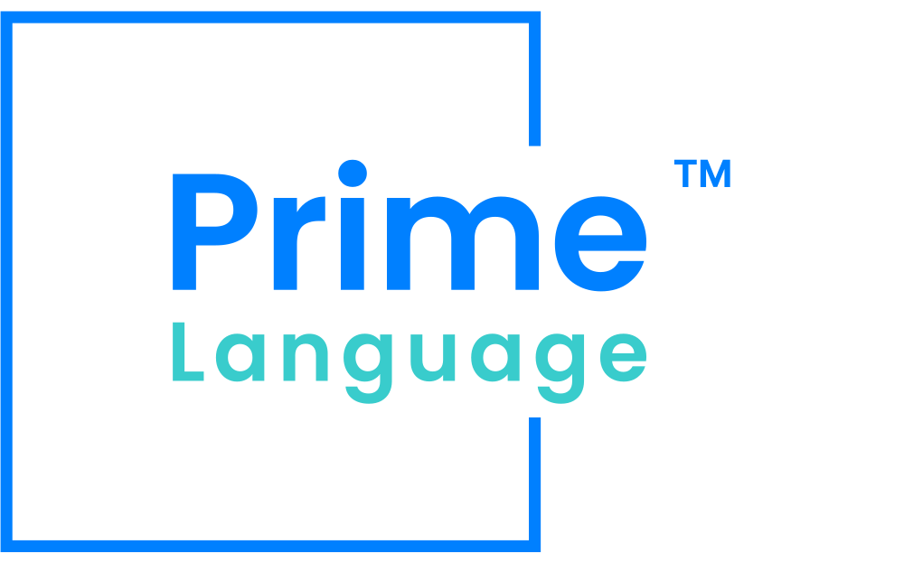

# Prime
**The Prime Programming Language and Toolchain** [Report a bug](https://github.com/joba14/prime/issues/new) · [Request a feature](https://github.com/joba14/prime/issues/new)

## Table of Contents
 - [Overview](#overview)
 - [Features](#features)
 - [Getting Started](#getting-started)
 - [Contributing](#contributing)
 - [License](#license)

## Overview
The prime programming language is a project that seeks to redefine the landscape of programming languages. It draws inspiration from the best aspects of Python, C, and Rust languages while introducing novel ideas to create a programming language that is both powerful and accessible.

[(to the top)](#prime)

## Features
The prime programming language and toolchain are designed with a unique blend of characteristics that prioritize type safety, memory safety, simplicity, and low-level capabilities. To delve deeper into the design principles and technical details behind these features, please refer to the [High-Level Design (HLD) document](./hld.md). This document outlines the overarching goals, architectural aspects, and components of the project, providing a comprehensive understanding of how "prime" achieves its objectives.

[(to the top)](#prime)

## Getting Started
TODO: !!!

[(to the top)](#prime)

## Contributing
At this time, I am not actively seeking contributions to the Prime Project. I appreciate your interest and enthusiasm for contributing to the project.

The reason for not actively seeking contributions is that I currently do not have well-defined ground rules and guidelines in place for contributors. I want to ensure that the contribution process is clear, fair, and productive for everyone involved.
However, I am always open to feedback, bug reports, and feature requests. If you encounter issues with the project or have ideas for improvements, please feel free to report in this project's repo issues page.

I value your interest in the project, and I may consider establishing contribution guidelines in the future. Until then, thank you for your understanding and support.

[(to the top)](#prime)

## License
The Prime project is released under the **Prime GPLv1** license. Users and contributors are required to review and comply with the license terms specified in the [license.md file](./license.md). The license outlines the permitted usage, distribution, and intellectual property rights associated with the Prime project.

Please refer to the [license.md file](./license.md) for more details. By using, modifying, or distributing the Prime project, you agree to be bound by the terms and conditions of the license.

[(to the top)](#prime)
